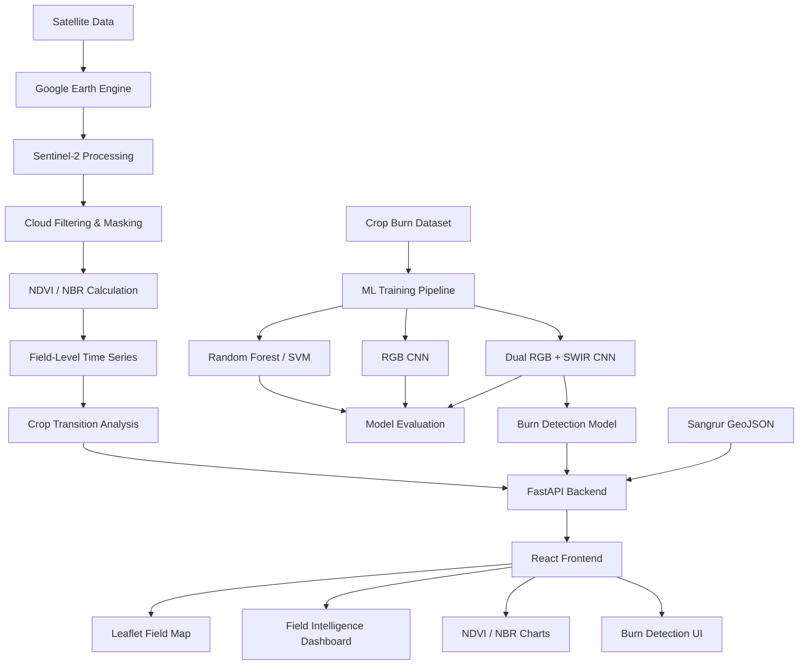
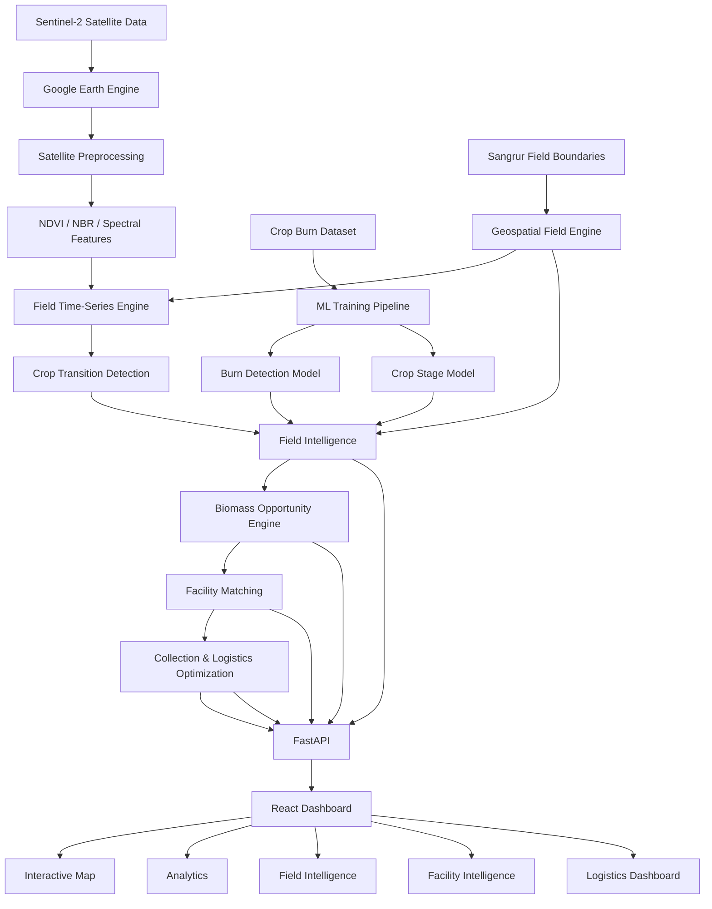

# 🌾 Project Parali
## Satellite AI for Agricultural Waste Detection, Crop Transition Intelligence & Biomass Recovery

> An AI-powered satellite intelligence platform designed to detect crop-residue burning, monitor crop-transition patterns, and create a foundation for connecting agricultural waste with biomass utilization facilities.

---

## 📌 Project Overview

**Project Parali** is a satellite-AI based agricultural intelligence platform focused on the crop-residue problem in North India.

The system combines:

- 🛰️ Sentinel-2 satellite imagery
- 🤖 Deep Learning
- 📊 Machine Learning
- 🌱 NDVI / NBR vegetation and burn indicators
- 🗺️ Interactive geospatial field visualization
- ⚡ FastAPI backend
- ⚛️ React frontend
- 🐍 Python-based ML pipeline
- ☁️ Google Earth Engine
- 📦 Biomass opportunity analysis

The long-term goal is to move from:

```text
Satellite Observation
        ↓
Field Intelligence
        ↓
Burn / Crop-Transition Detection
        ↓
Biomass Opportunity Estimation
        ↓
Facility Matching
        ↓
Collection / Logistics Planning
        ↓
Cleaner Agricultural Waste Management
````

---

# 🎯 Problem Statement

Crop residue generated after harvesting is often burned because farmers have limited time, equipment, and economically viable alternatives for residue management.

This creates:

* Air pollution
* Loss of potentially useful biomass
* Soil degradation
* Difficulties in residue collection
* Inefficient biomass utilization

Project Parali attempts to create a data-driven system that can identify agricultural field conditions from satellite data and eventually help convert agricultural residue into a usable biomass resource.

---

# 🚀 Project Vision

The final platform is intended to answer questions such as:

### Field level

* What is the current condition of this field?
* Is there evidence of crop residue burning?
* What is the vegetation trend?
* Has a significant crop-transition event occurred?
* What is the estimated biomass opportunity?

### Regional level

* Which areas have higher concentrations of crop-residue activity?
* Which fields may generate biomass opportunities?
* Where are potential biomass collection zones?

### Logistics level

* Which biomass facility is closest?
* Which fields could potentially be grouped into collection clusters?
* What transportation distance could be expected?

---

# 🏗️ Current Project Status

## Phase 1 — Satellite + ML Foundation
### Status: ✅ Completed
## Project Parali v1.0.0

Implemented:

* Hugging Face crop-burn dataset analysis
* Sangrur field GeoJSON preparation
* Sentinel-2 Earth Engine integration
* NDVI extraction
* NBR extraction
* Field-level satellite time series
* Classical ML baseline
* SVM model
* RGB CNN
* Dual RGB + SWIR CNN
* Harvest-stage classification
* Model comparison
* FastAPI backend
* React frontend
* Interactive Leaflet field map
* Field-level satellite analysis
* Git + Git LFS

---

# 📊 Phase 1 ML Results

The following models were evaluated on the Hugging Face crop-burn dataset.

| Model                   |   Accuracy | Notes                               |
| ----------------------- | ---------: | ----------------------------------- |
| Random Forest           |    ~87.00% | Classical ML baseline               |
| SVM                     |     88.01% | Strong classical baseline           |
| RGB ResNet18            |     81.27% | RGB-only CNN                        |
| **Dual RGB + SWIR CNN** | **91.76%** | Current burn-detection model        |
| Harvest Stage RF        |     82.77% | Current vegetation-phase classifier |

### Current burn detection model

```text
models/parali_dual_rgb_swir.pth
```

The Dual CNN achieved:

```text
Accuracy: 91.76%
F1 Score: 93.45%
```

Confusion matrix:

```text
                Predicted
                No Burn   Burn

Actual No Burn    88       11
Actual Burn       11      157
```

> These metrics are from the evaluated Hugging Face crop-burn dataset. They should not be interpreted as accuracy on the Sangrur Sentinel-2 field dataset.

---

# ⚠️ Important ML/Data Methodology

This section is extremely important for anyone contributing to the project.

## Burn Detection Dataset

The current 91.76% Dual CNN model was trained using:

```text
munish0838/crop-burn-detection-labeled
```

It was **not trained directly on raw Sentinel-2 images from Sangrur**.

The dataset contains RGB and SWIR-related image representations and labels such as:

* `burn_detected`
* `burn_severity`
* `burn_fraction_estimate`
* `burn_freshness`
* `active_smoke_visible`
* `vegetation_phase`

---

## SWIR Representation

The dataset's `swir_image` is an RGB-rendered SWIR representation.

It should not be described as raw multi-band Sentinel-2 SWIR data.

---

## Sangrur Dataset

The Sangrur field dataset contains field-level categories such as:

```text
unburnt
partially_burnt
completely_burnt
```

These labels describe burn-related field conditions.

They are **not direct ground-truth harvest dates**.

---

# 🌱 Crop Transition / Harvest Detection

The current time-series pipeline calculates:

```text
NDVI
NBR
```

over time for individual fields.

The system searches for a significant decline in smoothed NDVI after a peak.

The resulting date is called:

```text
Candidate crop-transition date
```

It should **not** currently be presented as a confirmed harvest date.

Actual harvest-date prediction requires validated harvest-date ground truth.

---

# 🛰️ Satellite Data Pipeline

Current satellite source:

```text
Google Earth Engine
        ↓
Sentinel-2 SR Harmonized
        ↓
Cloud Filtering
        ↓
Cloud Masking
        ↓
NDVI / NBR
        ↓
Field-Level Reduction
        ↓
CSV Time Series
        ↓
Harvest / Crop Transition Analysis
```

Dataset:

```text
COPERNICUS/S2_SR_HARMONIZED
```

Current bands used:

```text
B2  → Blue
B3  → Green
B4  → Red
B8  → NIR
B11 → SWIR
B12 → SWIR
```

---

# 📐 Satellite Indices

## NDVI

Normalized Difference Vegetation Index:

```text
NDVI = (NIR - RED) / (NIR + RED)
```

Using:

```text
NIR = B8
RED = B4
```

---

## NBR

Normalized Burn Ratio:

```text
NBR = (NIR - SWIR) / (NIR + SWIR)
```

Current implementation uses:

```text
NIR  = B8
SWIR = B12
```

---

# 📅 Current Time-Series Configuration

Current extraction period:

```text
Start: 2020-09-15
End:   2020-12-31
```

Cloud threshold:

```text
< 40%
```

Spatial scale:

```text
10 meters
```

The extraction processes Sentinel-2 images individually to avoid Earth Engine collection-query limitations.

---

# 🗺️ Study Area

Current primary study area:

```text
Sangrur, Punjab, India
```

The project uses field polygons from the Sangrur GeoJSON datasets.

---

# 📁 Project Structure

```text
Project-Parali/
│
├── data/
│   │
│   ├── sangrur/
│   │   ├── partially_completely_burnt_2020_11_10.geojson
│   │   └── partially_completely_burnt_2021_10_29.geojson
│   │
│   └── processed/
│       ├── sangrur_fields.geojson
│       ├── sangrur_ml_features.csv
│       ├── field_ndvi_timeseries.csv
│       ├── harvest_windows.csv
│       ├── final_model_comparison.csv
│       ├── model_accuracy_comparison.png
│       └── timeseries_plots/
│
├── models/
│   ├── parali_dual_best.pth
│   ├── parali_dual_rgb_swir.pth
│   ├── parali_harvest_stage_rf.pkl
│   └── parali_resnet18.pth
│
├── src/
│   ├── api.py
│   ├── create_test_images.py
│   ├── detect_harvest_window.py
│   ├── evaluate_models.py
│   ├── extract_ml_features.py
│   ├── extract_ndvi_nbr.py
│   ├── harvest_timeseries.py
│   ├── inspect_dataset.py
│   ├── inspect_sangrur.py
│   ├── plot_timeseries.py
│   ├── predict.py
│   ├── prepare_sangrur.py
│   ├── test_earth_engine.py
│   ├── train_baseline.py
│   ├── train_cnn.py
│   ├── train_dual_cnn.py
│   ├── train_harvest_stage.py
│   ├── train_svm.py
│   └── view_images.py
│
├── frontend/
│   ├── src/
│   │   ├── App.jsx
│   │   ├── App.css
│   │   ├── FieldMap.jsx
│   │   ├── main.jsx
│   │   └── index.css
│   │
│   ├── package.json
│   └── ...
│
├── .gitignore
├── .gitattributes
├── README.md
└── requirements.txt
```

---

# 🧠 System Architecture

## High-Level Architecture



---

# 🔄 End-to-End Data Flow

```text
                ┌──────────────────────┐
                │ Sentinel-2 Satellite │
                └──────────┬───────────┘
                           │
                           ▼
                ┌──────────────────────┐
                │ Google Earth Engine  │
                └──────────┬───────────┘
                           │
                           ▼
                ┌──────────────────────┐
                │ Cloud Filtering      │
                │ + Cloud Masking      │
                └──────────┬───────────┘
                           │
                           ▼
                ┌──────────────────────┐
                │ NDVI + NBR           │
                └──────────┬───────────┘
                           │
                           ▼
                ┌──────────────────────┐
                │ Field Time Series    │
                └──────────┬───────────┘
                           │
                           ▼
                ┌──────────────────────┐
                │ Crop Transition      │
                │ Analysis             │
                └──────────┬───────────┘
                           │
                           ▼
                ┌──────────────────────┐
                │ FastAPI Backend      │
                └──────────┬───────────┘
                           │
                           ▼
                ┌──────────────────────┐
                │ React Dashboard      │
                └──────────────────────┘
```

---

# 🤖 ML Architecture

## Dual RGB + SWIR CNN

Current burn-detection architecture:

```text
             RGB Image
                 │
                 ▼
          ┌─────────────┐
          │  ResNet18   │
          │   Backbone  │
          └──────┬──────┘
                 │
              Features
                 │
                 │
                 │
          ┌──────▼──────┐
          │ Concatenate │◄──────── SWIR Image
          └──────┬──────┘             │
                 │                     ▼
                 │              ┌─────────────┐
                 │              │  ResNet18   │
                 │              │   Backbone  │
                 │              └──────┬──────┘
                 │                     │
                 │                  Features
                 │                     │
                 └──────────┬──────────┘
                            ▼
                       1024 Features
                            │
                            ▼
                     Fully Connected
                       1024 → 128
                            │
                            ▼
                          2 Classes
                            │
                            ▼
                 ┌─────────────────────┐
                 │ No Burn / Burn      │
                 └─────────────────────┘
```

---

# 🧪 Model Evaluation

Current comparison:

```text
Random Forest
      │
      ├── Baseline
      │
SVM
      │
      ├── Classical ML
      │
RGB ResNet18
      │
      ├── Deep Learning
      │
Dual RGB + SWIR CNN
      │
      └── Current burn detector
```

Evaluation artifacts:

```text
data/processed/final_model_comparison.csv
data/processed/model_accuracy_comparison.png
```

---

# 🌾 Harvest / Crop-Transition Pipeline

Current pipeline:

```text
Field Polygon
      ↓
Sentinel-2 Images
      ↓
Cloud Filtering
      ↓
NDVI Calculation
      ↓
Temporal Smoothing
      ↓
Find NDVI Peak
      ↓
Search for Sustained Decline
      ↓
Candidate Transition Date
```

Current configuration:

```text
Smoothing Window: 3
Minimum Decline: 0.20
Consecutive Points: 2
```

Output:

```text
data/processed/harvest_windows.csv
```

---

# 🔌 Backend Architecture

Backend:

```text
FastAPI
```

Entry point:

```text
src/api.py
```

Current API:

```text
GET /
GET /health
GET /model-info
GET /fields
GET /field-analysis/{field_id}
POST /predict
```

---

# API Endpoints

## `GET /`

Basic API information.

---

## `GET /health`

Health check.

Example:

```json
{
  "status": "ok"
}
```

---

## `GET /model-info`

Returns information about the loaded burn detection model.

---

## `GET /fields`

Returns field GeoJSON used by the frontend map.

---

## `GET /field-analysis/{field_id}`

Returns field-level analysis including:

* field ID
* field category
* latest valid satellite observation
* NDVI
* NBR
* time-series data
* crop-transition information

---

## `POST /predict`

Accepts an uploaded image and runs the burn detection model.

Expected prediction categories:

```text
No Burn
Burn
```

---

# ⚛️ Frontend Architecture

Frontend:

```text
React
Vite
Leaflet
React-Leaflet
Recharts
```

Architecture:

```text
                 React App
                     │
          ┌──────────┴──────────┐
          │                     │
       FieldMap             Dashboard
          │                     │
       Leaflet              Charts
          │                 Recharts
          │                     │
          └──────────┬──────────┘
                     │
                     ▼
                 FastAPI
```

---

# 🗺️ Interactive Map

The frontend displays:

* Sangrur field polygons
* Field IDs
* Field categories
* Interactive popups
* Field selection
* Automatic field analysis

Clicking a field:

```text
Map Field
    ↓
Field ID
    ↓
GET /field-analysis/{field_id}
    ↓
Dashboard updates
```

---

# 📈 Current Dashboard

Current frontend provides:

### Field Map

Interactive field-level map.

### Field Selection

Field can be selected by:

* Clicking polygon
* Clicking numbered marker
* Entering field ID

### Field Analysis

Displays:

* Field category
* Latest satellite observation
* NDVI
* NBR
* Crop-transition analysis
* Time-series chart

### Burn Detection

Allows an image to be uploaded to the ML API.

---

# 💻 Local Development

## Requirements

Recommended:

```text
Python 3.11+
Node.js
npm
Git
Git LFS
Google Earth Engine account/project
```

---

# 🐍 Backend Setup

From project root:

```powershell
python -m venv venv
```

Activate:

```powershell
.\venv\Scripts\Activate.ps1
```

Install dependencies:

```powershell
pip install -r requirements.txt
```

---

# 🌍 Google Earth Engine

The satellite extraction scripts use Google Earth Engine.

Authentication must be configured before running Earth Engine scripts.

Test:

```powershell
python src/test_earth_engine.py
```

---

# ▶️ Run Backend

From project root:

```powershell
.\venv\Scripts\Activate.ps1
```

Then:

```powershell
uvicorn src.api:app --reload
```

Backend:

```text
http://127.0.0.1:8000
```

API documentation:

```text
http://127.0.0.1:8000/docs
```

---

# ⚛️ Run Frontend

Open another terminal:

```powershell
cd frontend
```

Install dependencies:

```powershell
npm install
```

Run:

```powershell
npm run dev
```

Frontend:

```text
http://localhost:5173
```

---

# 🔬 Running the Satellite Pipeline

## 1. Prepare Sangrur fields

```powershell
python src/prepare_sangrur.py
```

Output:

```text
data/processed/sangrur_fields.geojson
```

---

## 2. Extract Sentinel-2 time series

```powershell
python src/harvest_timeseries.py
```

Output:

```text
data/processed/field_ndvi_timeseries.csv
```

---

## 3. Detect candidate crop transitions

```powershell
python src/detect_harvest_window.py
```

Output:

```text
data/processed/harvest_windows.csv
```

---

## 4. Plot time series

```powershell
python src/plot_timeseries.py
```

---

# 🤖 Running ML Training

## Baseline

```powershell
python src/train_baseline.py
```

## SVM

```powershell
python src/train_svm.py
```

## RGB CNN

```powershell
python src/train_cnn.py
```

## Dual RGB + SWIR CNN

```powershell
python src/train_dual_cnn.py
```

## Harvest Stage Model

```powershell
python src/train_harvest_stage.py
```

---

# 🔍 Model Inference

Prediction script:

```text
src/predict.py
```

The API loads the trained Dual RGB + SWIR CNN.

---

# 📦 Important Generated Files

| File                            | Purpose                           |
| ------------------------------- | --------------------------------- |
| `sangrur_fields.geojson`        | Combined field boundaries         |
| `field_ndvi_timeseries.csv`     | Satellite field time series       |
| `harvest_windows.csv`           | Candidate crop-transition results |
| `sangrur_ml_features.csv`       | ML feature dataset                |
| `final_model_comparison.csv`    | Model comparison                  |
| `model_accuracy_comparison.png` | Accuracy visualization            |

---

# 👥 Collaboration Guide

This project is divided into multiple phases so contributors can work independently.

---

# 🟢 Phase 1 — Completed

### Core ML + Satellite Foundation

Completed components:

```text
Dataset
   ↓
ML Training
   ↓
Satellite Processing
   ↓
Field Time Series
   ↓
FastAPI
   ↓
React
   ↓
Interactive Map
```

Contributors should understand the existing pipeline before modifying core components.

---

# 🟡 Phase 2 — Field Intelligence Dashboard

### Current development phase

The goal of Phase 2 is to improve the existing field-level dashboard.

Planned modules:

```text
Field
 │
 ├── Area
 │
 ├── Category
 │
 ├── Latest NDVI
 │
 ├── Latest NBR
 │
 ├── Vegetation Status
 │
 ├── Burn Status
 │
 ├── Crop Transition
 │
 └── Time-Series Visualization
```

Potential frontend files:

```text
frontend/src/App.jsx
frontend/src/App.css
frontend/src/FieldMap.jsx
```

Potential backend work:

```text
src/api.py
```

---

# 🔵 Phase 3 — Biomass Opportunity Engine

### Planned

Phase 3 converts field intelligence into biomass opportunity analysis.

Potential pipeline:

```text
Field Analysis
      ↓
Crop Transition
      ↓
Residue Opportunity
      ↓
Estimated Biomass
      ↓
Collection Zone
      ↓
Biomass Facility Matching
```

Possible features:

* Biomass opportunity score
* Estimated residue quantity
* Nearby biomass facilities
* Distance calculation
* Collection radius
* Facility capacity matching
* Regional biomass statistics

---

# 🟣 Phase 4 — Logistics & Optimization

### Planned

Potential system:

```text
Fields
   ↓
Biomass Estimates
   ↓
Clustering
   ↓
Collection Centers
   ↓
Facility Assignment
   ↓
Route Optimization
```

Possible technologies:

* GeoPandas
* Shapely
* NetworkX
* OSRM / routing APIs
* Optimization algorithms
* Clustering

---

# 🔴 Phase 5 — Production & Deployment

Planned:

```text
React
   ↓
Production Build
   ↓
Cloud Hosting

FastAPI
   ↓
Containerization
   ↓
Cloud Deployment

ML Models
   ↓
Model Storage
   ↓
Inference Service
```

Potential infrastructure:

```text
Docker
AWS / GCP
GitHub Actions
CI/CD
Object Storage
Managed Database
```

---

# 🧩 Future System Architecture

The target architecture is:



---

# 🏭 Future Biomass Architecture

```text
                    FIELD DATA
                       │
                       ▼
              ┌──────────────────┐
              │ Field Intelligence│
              └────────┬─────────┘
                       │
                       ▼
              ┌──────────────────┐
              │ Biomass Estimate │
              └────────┬─────────┘
                       │
                       ▼
              ┌──────────────────┐
              │ Opportunity Score│
              └────────┬─────────┘
                       │
                       ▼
              ┌──────────────────┐
              │ Facility Matching│
              └────────┬─────────┘
                       │
                       ▼
              ┌──────────────────┐
              │ Collection Plan  │
              └────────┬─────────┘
                       │
                       ▼
              ┌──────────────────┐
              │ Route Optimization│
              └────────┬─────────┘
                       │
                       ▼
                 BIOMASS PLANT
```

---

# 👨‍💻 Contribution Areas

Contributors can work on independent modules.

## ML Team

Responsibilities:

```text
Dataset preparation
Feature engineering
Model training
Model evaluation
Model optimization
Model explainability
```

Potential files:

```text
src/train_*.py
src/evaluate_models.py
src/predict.py
```

---

## Satellite / GIS Team

Responsibilities:

```text
Earth Engine
Satellite preprocessing
NDVI
NBR
Field boundaries
Time-series processing
Spatial analysis
```

Potential files:

```text
src/harvest_timeseries.py
src/extract_ndvi_nbr.py
src/prepare_sangrur.py
src/extract_ml_features.py
```

---

## Backend Team

Responsibilities:

```text
FastAPI
API design
Data processing
ML inference
Validation
Error handling
Authentication
Performance
```

Main file:

```text
src/api.py
```

Future backend structure should evolve toward:

```text
backend/
├── api/
├── services/
├── models/
├── schemas/
├── core/
└── utils/
```

---

## Frontend Team

Responsibilities:

```text
React
Dashboard
Map UI
Charts
Field intelligence
Biomass visualization
Facility visualization
Responsive design
```

Main files:

```text
frontend/src/App.jsx
frontend/src/FieldMap.jsx
frontend/src/App.css
```

---

## Data / Analytics Team

Responsibilities:

```text
Data validation
Statistical analysis
Biomass estimation
Regional analytics
Visualization
Data quality
```

---

## DevOps Team

Future responsibilities:

```text
Docker
CI/CD
Cloud deployment
Environment variables
Monitoring
Logging
Model deployment
```

---

# 🔐 Security Rules

Never commit:

```text
.env
API keys
Passwords
Cloud credentials
Earth Engine credentials
Service-account credentials
Private tokens
Database credentials
```

The repository uses:

```text
.gitignore
.gitattributes
Git LFS
```

Large ML models are tracked using Git LFS.

---

# 🌿 Git Workflow

Before starting work:

```powershell
git pull origin main
```

Create a feature branch:

```powershell
git checkout -b feature/phase2-dashboard
```

Work on the feature.

Then:

```powershell
git add .
git commit -m "Add phase 2 field intelligence dashboard"
git push -u origin feature/phase2-dashboard
```

Create a Pull Request on GitHub.

Do not directly modify `main` for major features.

---

# 🧪 Before Opening a Pull Request

Every contributor should verify:

```text
[ ] Application starts
[ ] Backend starts
[ ] Frontend starts
[ ] Existing API endpoints work
[ ] Existing map works
[ ] Existing field analysis works
[ ] No secrets committed
[ ] No unnecessary generated files committed
[ ] README updated if architecture changes
[ ] New code has meaningful names
[ ] Existing functionality is not broken
```

---

# 🧠 Development Principles

## 1. Do not break existing functionality

Phase 2 should build on Phase 1 rather than replacing working components unnecessarily.

---

## 2. Separate ML from API logic

Avoid putting training code inside:

```text
src/api.py
```

Training should remain in separate scripts.

---

## 3. Separate frontend and backend

Frontend:

```text
frontend/
```

Backend:

```text
src/
```

---

## 4. Use reusable components

As the frontend grows, break large components into:

```text
components/
pages/
services/
hooks/
utils/
```

---

## 5. Keep data pipelines reproducible

Whenever a generated dataset changes, document:

* Source
* Date range
* Processing method
* Parameters
* Output format

---

# 📌 Known Limitations

Current system has several limitations.

### 1. Burn model domain limitation

The 91.76% model evaluation comes from the Hugging Face crop-burn dataset.

It has not been validated as 91.76% accuracy on the Sangrur Sentinel-2 dataset.

---

### 2. Harvest date limitation

Current crop-transition dates are candidate dates based on NDVI decline.

They are not validated harvest dates.

---

### 3. Biomass estimation

Future biomass quantities must be treated as estimates unless validated using appropriate field-level ground truth.

---

### 4. Satellite observations

Clouds, image availability, spatial resolution, field size, and temporal gaps can affect time-series quality.

---

### 5. Generalization

Performance may change when the model is applied to:

* different regions
* different crop types
* different seasons
* different satellite products
* different image preprocessing methods

---

# 📚 Recommended Development Order

New contributors should understand the system in this order:

```text
1. README.md
      ↓
2. Project structure
      ↓
3. src/api.py
      ↓
4. frontend/src/App.jsx
      ↓
5. frontend/src/FieldMap.jsx
      ↓
6. field_ndvi_timeseries.csv
      ↓
7. harvest_windows.csv
      ↓
8. ML training scripts
      ↓
9. Earth Engine pipeline
      ↓
10. Phase 2 / Phase 3 modules
```

---

# 🧭 Where We Are Now

Current architecture:

```text
                ┌───────────────────┐
                │ Sentinel-2 / GEE  │
                └─────────┬─────────┘
                          │
                          ▼
                ┌───────────────────┐
                │ NDVI / NBR        │
                └─────────┬─────────┘
                          │
                          ▼
                ┌───────────────────┐
                │ Field Time Series │
                └─────────┬─────────┘
                          │
                          ▼
                ┌───────────────────┐
                │ Crop Transition   │
                └─────────┬─────────┘
                          │
                          ▼
 ┌────────────────┐   ┌───────────────┐
 │ Burn ML Model  │──►│   FastAPI     │
 └────────────────┘   └───────┬───────┘
                              │
                              ▼
                       ┌──────────────┐
                       │ React + Map  │
                       └──────────────┘
```

---

# 🎯 Next Development Target

## Phase 2

Build:

```text
Field Intelligence Dashboard
```

with:

```text
Field
 ├── Area
 ├── Category
 ├── NDVI
 ├── NBR
 ├── Burn Status
 ├── Crop Status
 ├── Candidate Transition
 └── Time-Series
```

---

# 🚀 Long-Term Goal

The ultimate system should evolve from a satellite monitoring dashboard into a complete agricultural biomass intelligence platform:

```text
                  SATELLITE
                      │
                      ▼
               FIELD INTELLIGENCE
                      │
          ┌───────────┴───────────┐
          ▼                       ▼
    BURN DETECTION          CROP TRANSITION
          │                       │
          └───────────┬───────────┘
                      ▼
              BIOMASS OPPORTUNITY
                      │
                      ▼
              FACILITY MATCHING
                      │
                      ▼
             COLLECTION PLANNING
                      │
                      ▼
              ROUTE OPTIMIZATION
                      │
                      ▼
                BIOMASS PLANT
```

The objective is to create a system where agricultural residue can be identified, quantified, geographically organized, and eventually connected to economically useful biomass pathways.

---

# 👥 Team Collaboration

The project is designed to support parallel development.

Suggested ownership:

| Team            | Responsibility                 |
| --------------- | ------------------------------ |
| ML              | Burn detection + crop models   |
| GIS / Satellite | Earth Engine + field analytics |
| Backend         | FastAPI + services             |
| Frontend        | Dashboard + maps               |
| Data            | Biomass + regional analytics   |
| DevOps          | Docker + deployment + CI/CD    |

Each contributor should work on a feature branch and submit a Pull Request.

---

# 📜 Project Status

```text
Phase 1  ████████████████████  100%
Phase 2  ░░░░░░░░░░░░░░░░░░░░    0%
Phase 3  ░░░░░░░░░░░░░░░░░░░░    0%
Phase 4  ░░░░░░░░░░░░░░░░░░░░    0%
Phase 5  ░░░░░░░░░░░░░░░░░░░░    0%
```

---

# 🌾 Project Parali

**Satellite Intelligence → Field Intelligence → Biomass Intelligence**

Built for innovation in agricultural waste management.

````

### One thing I'd add before collaborators join

Your README will be much more useful if we also add a **`docs/` architecture folder** later:

```text
docs/
├── architecture/
│   ├── system-architecture.md
│   ├── data-pipeline.md
│   ├── ml-pipeline.md
│   └── api-architecture.md
│
├── development/
│   ├── setup.md
│   ├── contribution-guide.md
│   └── phase-roadmap.md
│
└── diagrams/
    ├── system-architecture.png
    ├── ml-pipeline.png
    └── data-flow.png
````


