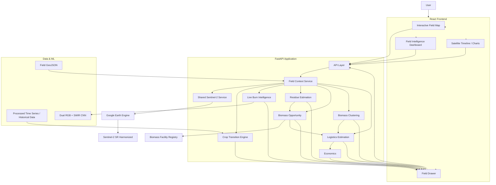
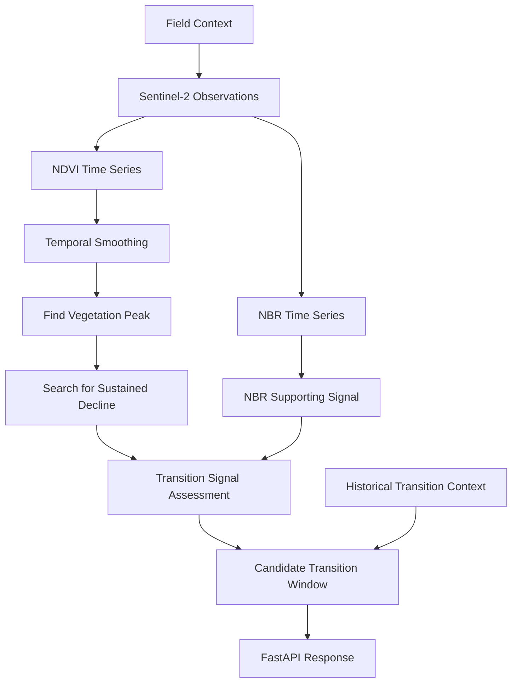
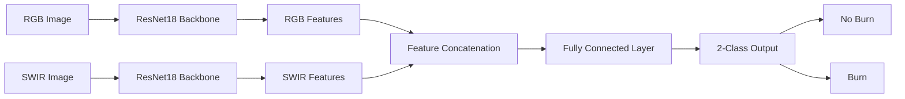
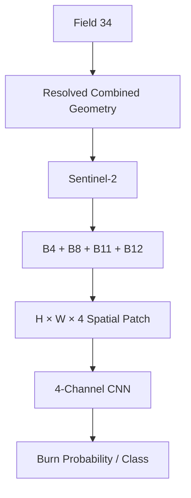
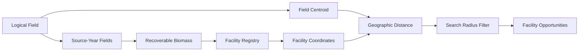
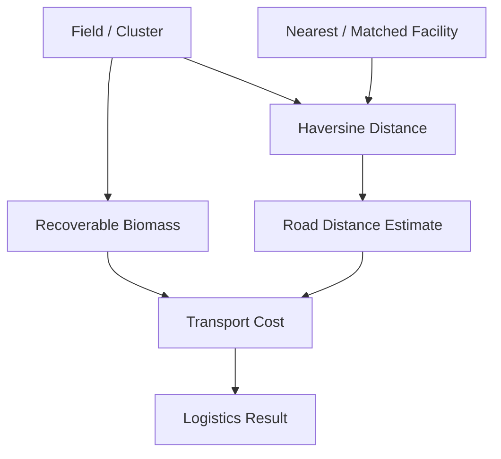
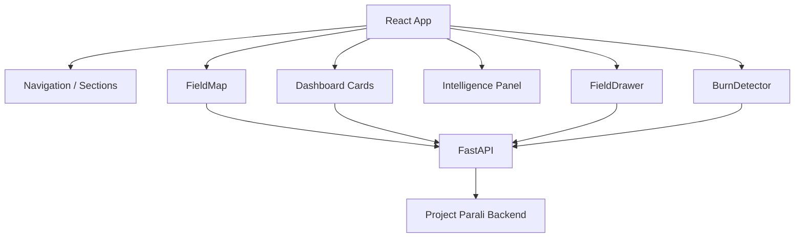
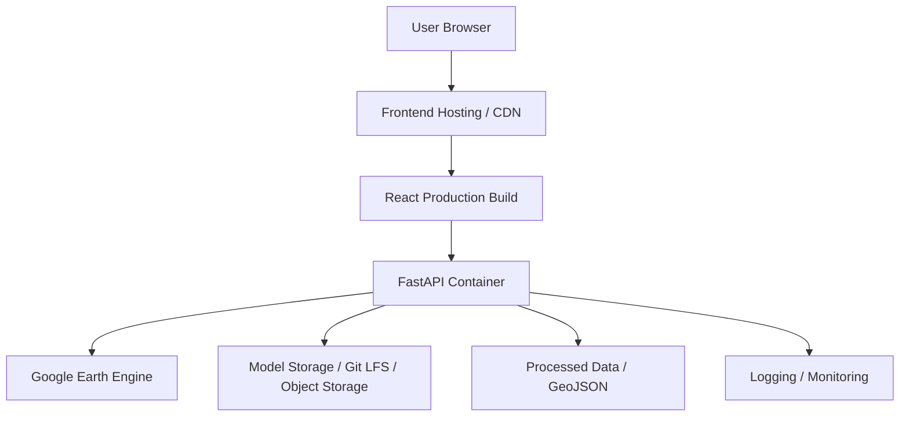
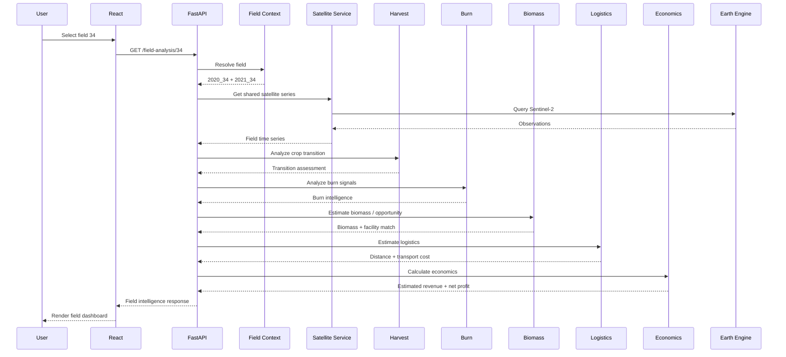
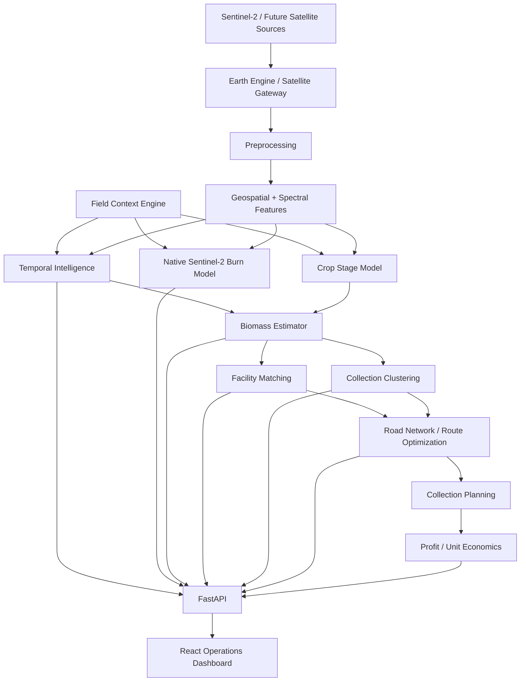

# 🌾 Project Parali

## Satellite AI for Crop-Residue Detection, Crop-Transition Intelligence & Biomass Recovery

<p align="center">

**Satellite Intelligence → Field Intelligence → Biomass Intelligence → Operational Planning**

</p>

> Project Parali is an AI-powered geospatial intelligence platform that uses satellite observations, machine learning, field-level analytics and biomass operations logic to identify crop-transition and burn-related signals, estimate recoverable agricultural residue, match supply with biomass facilities, organize nearby fields into collection clusters, estimate transport cost, and calculate an **estimated net profit** under configurable economic assumptions.

---

## 📖 What is Project Parali?

Agricultural residue is not simply a waste problem. It is also a **timing, visibility, collection and logistics problem**.

A biomass facility may want to purchase agricultural residue, while the difficult questions happen earlier:

- Which fields are approaching or have passed a crop-transition event?
- Which fields show burn-related signals?
- How much residue may be recoverable?
- Which fields are geographically close enough to collect together?
- Which biomass facility can potentially receive the material?
- What transport distance and cost should be expected?
- After transport, is the biomass opportunity still economically meaningful?

Project Parali is designed to connect these pieces into one field-centric system.

```text
                 ┌──────────────────────┐
                 │  Satellite / GIS Data │
                 └──────────┬───────────┘
                            ↓
                 ┌──────────────────────┐
                 │    Field Context     │
                 └──────────┬───────────┘
                            ↓
                 ┌──────────────────────┐
                 │ Sentinel-2 Signals   │
                 │ NDVI / NBR / SWIR    │
                 └──────────┬───────────┘
                            ↓
            ┌───────────────┴────────────────┐
            ↓                                ↓
 ┌─────────────────────┐          ┌─────────────────────┐
 │ Crop Transition     │          │ Burn Intelligence   │
 │ / Harvest Signals   │          │ Spectral + ML       │
 └──────────┬──────────┘          └──────────┬──────────┘
            └───────────────┬────────────────┘
                            ↓
                 ┌──────────────────────┐
                 │ Residue Estimation   │
                 └──────────┬───────────┘
                            ↓
                 ┌──────────────────────┐
                 │ Biomass Opportunity │
                 └──────────┬───────────┘
                            ↓
              ┌─────────────┴─────────────┐
              ↓                           ↓
   ┌────────────────────┐       ┌────────────────────┐
   │ Facility Matching  │       │ Collection Clusters│
   └─────────┬──────────┘       └─────────┬──────────┘
             └─────────────┬──────────────┘
                           ↓
                 ┌──────────────────────┐
                 │ Logistics Estimation │
                 └──────────┬───────────┘
                            ↓
                 ┌──────────────────────┐
                 │ Estimated Net Profit│
                 └──────────┬───────────┘
                            ↓
                 ┌──────────────────────┐
                 │ Decision Dashboard   │
                 └──────────────────────┘
```

This README uses the uploaded project README as the structural starting point, while expanding it around the current field-context, live satellite, biomass, logistics and economics architecture. fileciteturn92file0L8-L40

---

# 🎯 Problem Statement

Crop residue generated after harvesting can be difficult to manage within a short operational window. Where residue is burned, the result can include air-pollution impacts, biomass loss and inefficient use of agricultural resources.

The core problem Project Parali addresses is:

> **How can satellite intelligence be converted into field-level, operationally useful biomass intelligence before residue is lost or burned?**

The project therefore focuses on the complete information chain:

```text
WHEN is the field transitioning?
          ↓
WHAT signals are visible?
          ↓
HOW MUCH biomass may be recoverable?
          ↓
WHERE can it go?
          ↓
HOW can nearby fields be collected efficiently?
          ↓
WHAT transport cost is expected?
          ↓
WHAT is the estimated economic opportunity?
```

---

# 🚀 Project Vision

Project Parali aims to evolve from a satellite-monitoring application into a **field-to-facility agricultural biomass intelligence platform**.

### Field Intelligence

```text
Field
 ├── Geometry
 ├── Area
 ├── Source-year records
 ├── Current satellite observation
 ├── NDVI
 ├── NBR
 ├── Vegetation / burn signals
 ├── Crop-transition assessment
 └── Satellite time series
```

### Biomass Intelligence

```text
Field Intelligence
      ↓
Residue Estimate
      ↓
Recoverable Biomass
      ↓
Facility Opportunity
      ↓
Collection Cluster
```

### Operational Intelligence

```text
Collection Cluster
      ↓
Facility Assignment
      ↓
Transport Distance
      ↓
Transport Cost
      ↓
Estimated Gross Revenue
      ↓
Estimated Net Profit
```

---

# 🧠 Design Philosophy

Project Parali follows five architectural principles.

### 1. One field context, many services

Every downstream intelligence service should consume the same resolved field context.

```text
              FIELD CONTEXT
                    │
       ┌────────────┼─────────────┐
       ↓            ↓             ↓
   Satellite      Harvest        Biomass
       │            │             │
       └────────────┼─────────────┘
                    ↓
                Logistics
```

This prevents different modules from independently interpreting the same field ID in different ways.

### 2. Preserve source provenance

A logical field may represent multiple historical source records.

Example:

```text
Logical Field 34
 ├── 2020_34
 └── 2021_34
```

The system preserves those source IDs instead of flattening them away.

### 3. Separate evidence from conclusions

Satellite indicators are evidence.

A decreasing NDVI value is a signal. It is not automatically proof of harvest.

Similarly, a burn-related spectral change is a signal and should be interpreted with contextual evidence.

### 4. Separate current intelligence from trained-model evaluation

The existing image-based CNN has its own training/evaluation dataset.

Live Sentinel-2 analytics are a different domain.

The system therefore avoids presenting the existing CNN's benchmark metrics as if they were Sentinel-2 field-model accuracy.

### 5. Keep economic outputs assumption-aware

Biomass quantity, sale price and transport cost are estimates under configurable assumptions.

The application labels the output as:

```text
Estimated Net Profit
```

rather than representing it as confirmed realized profit.

---

# 🏗️ Complete System Architecture

## 1. High-Level Architecture



---

# 🔄 2. End-to-End System Flow

```text
┌──────────────────────────┐
│      User selects field  │
└─────────────┬────────────┘
              ↓
┌──────────────────────────┐
│        Field Context     │
│  Resolve logical field   │
│  + source records        │
│  + geometry + metadata   │
└─────────────┬────────────┘
              ↓
┌──────────────────────────┐
│   Shared Satellite Layer │
│ Sentinel-2 + GEE         │
│ Cloud filtering/masking  │
│ Spectral features        │
└─────────────┬────────────┘
              ↓
       ┌──────┼───────┐
       ↓      ↓       ↓
    Harvest  Burn   Satellite
    Signal   Signal  Time Series
       │      │       │
       └──────┼───────┘
              ↓
┌──────────────────────────┐
│      Field Intelligence  │
└─────────────┬────────────┘
              ↓
┌──────────────────────────┐
│     Residue Estimation   │
└─────────────┬────────────┘
              ↓
       ┌──────┴───────┐
       ↓              ↓
 Facility Matching  Clustering
       │              │
       └──────┬───────┘
              ↓
┌──────────────────────────┐
│   Logistics Estimation   │
└─────────────┬────────────┘
              ↓
┌──────────────────────────┐
│   Economic Calculation   │
│ Revenue - Transport     │
└─────────────┬────────────┘
              ↓
┌──────────────────────────┐
│    React Decision UI     │
└──────────────────────────┘
```

---

# 🧩 3. Field Context Architecture

The field context layer is the **source of truth for field identity and geometry**.

## Multi-source logical field

```text
34
│
├── 2020_34
│
└── 2021_34
```

The context layer produces:

```text
logical_field_id
logical_field_number
source_field_ids
source_field_count
geometry_mode
geometry
centroid
area
categories
source_fields
source_indicators
```

### Combined geometry

For a multi-source logical field:

```text
2020_34 geometry
        +
2021_34 geometry
        ↓
Combined MultiPolygon
```

### Aggregated area

```text
Area(logical field)
    =
Σ Area(source fields)
```

### Aggregated centroid

For multiple sources, the centroid is derived using source-area weighting.

```text
Weighted Centroid
=
Σ(source centroid × source area)
──────────────────────────────
      Σ(source area)
```

### Single-source field

For a field such as:

```text
343 → 2021_343
```

the original geometry is used directly.

---

# 🛰️ 4. Shared Satellite Intelligence Layer

The shared satellite service prevents every module from separately implementing Earth Engine queries.

## Satellite pipeline


## Current Sentinel-2 collection

```text
COPERNICUS/S2_SR_HARMONIZED
```

## Current spectral bands

```text
B4  → Red
B8  → NIR
B11 → SWIR
B12 → SWIR2
```

Additional source bands may be retained where required by the satellite service or preprocessing workflow.

## Derived indicators

### NDVI

```text
NDVI = (B8 - B4) / (B8 + B4)
```

### NBR

```text
NBR = (B8 - B12) / (B8 + B12)
```

### NBR2

```text
NBR2 = (B11 - B12) / (B11 + B12)
```

### SWIR2 / NIR

```text
SWIR2 / NIR = B12 / B8
```

---

# ☁️ 5. Cloud and Observation Handling

Satellite intelligence depends on the quality of the underlying observations.

The shared service therefore uses:

```text
Image collection
      ↓
Cloud metadata filtering
      ↓
QA60 cloud/cirrus masking
      ↓
Band scaling
      ↓
Field reduction
      ↓
Valid observations
```

The service also groups measurements by observation date so downstream modules can consume a clean time series.

A short-lived cache can reduce repeated Earth Engine requests when the same field is queried repeatedly by different UI modules.

---

# 🌱 6. Crop-Transition / Harvest Intelligence

The current harvest engine should be interpreted as **crop-transition intelligence** rather than confirmed harvest-date ground truth.

## Pipeline



## Important interpretation

The current engine detects a pattern such as:

```text
Vegetation peak
      ↓
Sustained decline
      ↓
Potential crop transition
```

It should therefore be described as:

```text
Candidate crop-transition date
```

or:

```text
Estimated transition window
```

rather than a confirmed harvest date.

Actual harvest-date prediction requires validated field-level harvest-date ground truth.

---

# 🔥 7. Live Burn Intelligence

The live burn system is field-driven.

The user does not need to upload images simply to inspect a selected field's live satellite burn signals.

## Live field analysis

```text
Select Field
     ↓
Field Context
     ↓
Combined Geometry
     ↓
Live Sentinel-2 Observations
     ↓
Burn-Related Spectral Evidence
     ↓
Field Burn Intelligence
```

The live analysis can consider:

```text
NDVI change
NBR change
NBR2 change
SWIR2 change
SWIR2 / NIR change
Recent vs previous observations
Trend context
Historical field information
```

The frontend presents this as evidence with supporting reasons.

---

# 🤖 8. Dual RGB + SWIR CNN

Project Parali also contains a trained **Dual RGB + SWIR ResNet18** image model.

## Architecture



The model architecture follows:

```text
RGB branch    → 512 features
SWIR branch   → 512 features
                    ↓
              Concatenate
                    ↓
                 1024
                    ↓
               FC 1024→128
                    ↓
               2 classes
```

---

# ⚠️ 9. ML/Data Methodology

This distinction is important.

The currently reported Dual CNN benchmark was trained and evaluated on:

```text
munish0838/crop-burn-detection-labeled
```

It was not trained directly on raw four-band Sentinel-2 field patches from Sangrur.

The uploaded baseline README reports the following evaluation results:

| Model | Accuracy | Purpose |
|---|---:|---|
| Random Forest | ~87.00% | Classical ML baseline |
| SVM | 88.01% | Classical ML |
| RGB ResNet18 | 81.27% | RGB-only deep learning |
| **Dual RGB + SWIR CNN** | **91.76%** | Current image-based burn model |
| Harvest Stage RF | 82.77% | Vegetation-phase classifier |

The same baseline reports:

```text
Dual CNN Accuracy: 91.76%
Dual CNN F1 Score: 93.45%
```

These values are benchmark results on the evaluated image dataset, not measured accuracy on the Sangrur Sentinel-2 field dataset. The sample README explicitly makes this distinction. fileciteturn92file0L115-L150

---

# 🛰️ 10. Current Live Burn vs Manual ML Detector

Project Parali supports two conceptually different burn workflows.

## A. Live field burn intelligence

```text
Field ID
   ↓
Sentinel-2
   ↓
Spectral evidence
   ↓
Live field assessment
```

This is the field-oriented workflow.

## B. Manual image inference

```text
RGB image
+
SWIR image
   ↓
Dual CNN
   ↓
No Burn / Burn
```

This is the model-inference workflow.

Keeping them separate prevents the UI from implying that the image-trained model is a native Sentinel-2 four-band model.

---

# 🔮 11. Future Native Sentinel-2 Burn Model

The next ML evolution can use spatial Sentinel-2 patches directly.



This future model should be independently trained and validated using Sentinel-2-compatible labels.

---

# 🌾 12. Residue Estimation

The residue engine converts field-level parameters into an estimated recoverable biomass quantity.

Conceptually:

```text
Field Area
      ×
Crop Yield Assumption
      ×
Residue/Product Ratio
      =
Gross Residue
      ×
Collection Efficiency
      =
Recoverable Biomass
```

One current configured assumption set is:

```text
Crop: Paddy
Yield: 4.132 t/ha
Residue/Product Ratio: 1.10
Collection Efficiency: 70%
```

These values are model assumptions.

They should be configurable and documented rather than presented as direct satellite measurements.

---

# 🏭 13. Biomass Opportunity Engine

The opportunity engine connects estimated biomass supply with potential nearby biomass facilities.

Current facility examples used by the project include:

```text
Verbio India Pvt. Ltd. CBG Plant
Bhutal Kalan, Sangrur

Sangrur RNG Private Limited CBG Plant
Fatehgarh Panjgraian, Dhuri

Patiala RNG Private Limited CBG Plant
Jaikhar, Patran
```

## Matching architecture



The engine can retain source-year opportunity information while also providing logical-field aggregation.

---

# 🧭 14. Biomass Clustering

Individual fields are often too small to evaluate in isolation for collection planning.

Project Parali therefore supports field clustering.

## Concept

```text
Many nearby fields
        ↓
Spatial grouping
        ↓
Collection cluster
        ↓
Aggregate biomass
        ↓
Truck / load estimate
        ↓
Operational planning
```

The cluster service can use a configured geographic radius and connected-component style grouping.

A logical multi-source field should not create artificial cross-year adjacency merely because two source records share the same logical field number.

---

# 🚚 15. Logistics Estimation

The logistics engine connects biomass quantity and facility distance.

## Current conceptual formula

```text
Straight-line distance
        ×
Road factor
        =
Estimated road distance
```

Then:

```text
Recoverable biomass
        ×
Estimated road distance
        ×
Transport rate
        =
Estimated transport cost
```

Current configured assumptions include:

```text
Search radius: 50 km
Road factor: 1.30
Transport rate: ₹4.50 / tonne-km
Small-load threshold: 2 tonnes
```

The exact values are configuration assumptions and should be treated as estimates.

## Logistics architecture



The project retains source-level logistics calculations for multi-source logical fields and can aggregate them to a logical-field result.

---

# 💰 16. Estimated Net Profit

Project Parali extends logistics analysis into a transparent economic estimate.

## Formula

```text
Recoverable Biomass
        ×
Biomass Sale Price / tonne
        =
Gross Biomass Revenue
```

Then:

```text
Gross Biomass Revenue
        −
Estimated Transport Cost
        =
Estimated Net Profit
```

### Current configurable sale-price assumption

```text
₹2,500 / tonne
```

This should be treated as a model assumption, not a live market quote.

## Economic response

```text
economics:
    biomass_sale_price_inr_per_tonne
    gross_revenue_inr
    transport_cost_inr
    net_profit_inr
    net_profit_per_tonne_inr
    profit_margin_percent
```

## Multi-source calculation

For a field such as:

```text
34
 ├── 2020_34
 └── 2021_34
```

the system can aggregate:

```text
Total recoverable biomass
+
Source-level logistics costs
+
Combined revenue
=
Logical-field economics
```

### Scope of the current profit estimate

The current net-profit calculation is:

```text
Biomass sale revenue
−
Estimated transport cost
```

It does **not** automatically include:

```text
Harvesting
Baling
Loading
Labour
Taxes
Facility fees
Equipment costs
Other operating expenses
```

Therefore the UI uses:

> **Estimated Net Profit**

rather than realized profit.

---

# 🧠 17. Business / Intelligence Pipeline

The complete operational chain is:

```text
┌─────────────────────┐
│ Satellite Signals   │
└──────────┬──────────┘
           ↓
┌─────────────────────┐
│ Crop Transition     │
└──────────┬──────────┘
           ↓
┌─────────────────────┐
│ Residue Estimation  │
└──────────┬──────────┘
           ↓
┌─────────────────────┐
│ Biomass Opportunity │
└──────────┬──────────┘
           ↓
┌─────────────────────┐
│ Facility Matching   │
└──────────┬──────────┘
           ↓
┌─────────────────────┐
│ Collection Cluster  │
└──────────┬──────────┘
           ↓
┌─────────────────────┐
│ Logistics Estimate  │
└──────────┬──────────┘
           ↓
┌─────────────────────┐
│ Revenue / Cost      │
└──────────┬──────────┘
           ↓
┌─────────────────────┐
│ Estimated Net Profit│
└─────────────────────┘
```

---

# 🔌 18. Backend Architecture

The backend is built around FastAPI and reusable intelligence services.

```text
backend/
│
├── api.py
│
├── field_context.py
├── satellite_service.py
├── harvest_prediction.py
├── live_burn_analysis.py
├── residue_estimation.py
├── biomass_opportunity.py
├── biomass_clustering.py
├── logistics_estimation.py
├── predict.py
│
├── models/
│   ├── *.pth
│   └── *.pkl
│
└── data/
    └── processed/
```

The intended dependency direction is:

```text
API
 ↓
Field Context
 ↓
Shared Satellite / Data Services
 ↓
Domain Intelligence Modules
 ↓
API Response
```

Training scripts remain outside the runtime API path.

---

# 🧱 19. Backend Service Responsibilities

| Service | Responsibility |
|---|---|
| `field_context.py` | Resolve logical field → source fields + geometry + metadata |
| `satellite_service.py` | Shared Sentinel-2/GEE observations and spectral features |
| `harvest_prediction.py` | Crop-transition / harvest-window signal analysis |
| `live_burn_analysis.py` | Live satellite burn intelligence |
| `residue_estimation.py` | Estimated residue and recoverable biomass |
| `biomass_opportunity.py` | Facility matching and biomass opportunity |
| `biomass_clustering.py` | Spatial collection grouping |
| `logistics_estimation.py` | Distance, road estimate and transport cost |
| `predict.py` | Existing image-based Dual CNN inference |
| `api.py` | HTTP API orchestration |

---

# ⚛️ 20. Frontend Architecture

The frontend is built using:

```text
React
Vite
Leaflet / React-Leaflet
Recharts
CSS
```

## Frontend architecture



---

# 🗺️ 21. Interactive Field Map

The map is a core entry point into the system.

The user can:

```text
View field polygons
       ↓
Inspect field identifiers
       ↓
Select a field
       ↓
Open field intelligence
```

Typical selection flow:

```text
Map Polygon
    ↓
Logical Field ID
    ↓
/field-analysis/{field_id}
    ↓
Field Drawer
    ↓
Satellite + Biomass Intelligence
```

The map is designed to make the platform field-centric rather than purely chart-centric.

---

# 🧰 22. Field Intelligence Drawer

A selected field can expose:

### Current Field State

```text
Area
Category
Latest observation
Current condition
```

### Live Sentinel-2 Signal

```text
NDVI
NBR
Trend
Signal strength
Crop-transition assessment
```

### Burn Detection

```text
Burn-related spectral evidence
Current burn status
Historical context
ML evidence where applicable
```

### Biomass Intelligence

```text
Residue estimate
Recoverable biomass
Facility opportunity
Collection cluster
Logistics
Estimated net profit
```

### Satellite Timeline

```text
Date
NDVI
NBR
Relevant spectral signals
Historical observations
```

---

# 📡 23. API Reference

The current architecture exposes domain-specific endpoints.

## Core

### `GET /`

Returns basic API information.

### `GET /health`

Health check.

Example:

```json
{
  "status": "ok"
}
```

### `GET /model-info`

Returns loaded model metadata.

### `GET /fields`

Returns the field dataset used by the frontend map.

---

## Field Intelligence

### `GET /field-analysis/{field_id}`

Returns combined field-level intelligence.

Typical content:

```text
Field identity
Category
Area
Latest observation
NDVI
NBR
Time series
Transition information
Source-field information
```

---

## Live Satellite Modules

### `GET /live-harvest-prediction/{field_id}`

Returns live crop-transition / harvest-window assessment.

### `GET /live-burn-analysis/{field_id}`

Returns field-driven live burn intelligence based on satellite evidence and available ML evidence.

---

## Biomass Modules

### `GET /residue-estimation/{field_id}`

Returns estimated residue and recoverable biomass.

### `GET /biomass-opportunity/{field_id}`

Returns nearby biomass facilities and opportunity information.

### `GET /biomass-cluster/{field_id}`

Returns the field's collection cluster information.

### `GET /biomass-clusters`

Returns available biomass clusters.

### `GET /logistics-estimation/{field_id}`

Returns distance, estimated road distance and transport cost.

---

## Manual ML Inference

### `POST /predict`

Accepts the image inputs required by the existing Dual RGB + SWIR model.

Expected classes:

```text
No Burn
Burn
```

This endpoint is conceptually separate from live field satellite analysis.

---

# 🔗 24. Golden End-to-End Field Flow

A key release test is the multi-source field:

```text
34
```

Expected architecture:

```text
34
 ↓
2020_34 + 2021_34
 ↓
Combined Field Context
 ↓
Combined Geometry
 ↓
Sentinel-2
 ↓
Harvest / Transition
 ↓
Burn Intelligence
 ↓
Residue
 ↓
Biomass Opportunity
 ↓
Clustering
 ↓
Logistics
 ↓
Revenue
 ↓
Estimated Net Profit
 ↓
React Field Drawer
```

A single-source compatibility test is:

```text
343
 ↓
2021_343
 ↓
Single Source Geometry
 ↓
Same intelligence pipeline
```

This verifies both the logical grouping architecture and the single-source fallback.

---

# 📁 25. Recommended Project Structure

```text
Project-Parali/
│
├── backend/
│   ├── api.py
│   ├── field_context.py
│   ├── satellite_service.py
│   ├── harvest_prediction.py
│   ├── live_burn_analysis.py
│   ├── residue_estimation.py
│   ├── biomass_opportunity.py
│   ├── biomass_clustering.py
│   ├── logistics_estimation.py
│   ├── predict.py
│   │
│   ├── models/
│   │   ├── parali_dual_rgb_swir.pth
│   │   ├── parali_dual_best.pth
│   │   ├── parali_resnet18.pth
│   │   └── parali_harvest_stage_rf.pkl
│   │
│   └── requirements.txt
│
├── data/
│   ├── sangrur/
│   │   ├── partially_completely_burnt_2020_11_10.geojson
│   │   └── partially_completely_burnt_2021_10_29.geojson
│   │
│   └── processed/
│       ├── sangrur_fields.geojson
│       ├── field_ndvi_timeseries.csv
│       ├── harvest_windows.csv
│       ├── sangrur_ml_features.csv
│       ├── final_model_comparison.csv
│       └── timeseries_plots/
│
├── frontend/
│   ├── src/
│   │   ├── App.jsx
│   │   ├── FieldMap.jsx
│   │   ├── index.css
│   │   ├── styles.css
│   │   │
│   │   └── components/
│   │       ├── FieldDrawer.jsx
│   │       ├── BurnDetector.jsx
│   │       ├── DashboardCards.jsx
│   │       ├── IntelligencePanel.jsx
│   │       └── MapLegend.jsx
│   │
│   ├── package.json
│   └── ...
│
├── .env.example
├── .gitignore
├── .gitattributes
├── README.md
└── ...
```

---

# 💻 26. Local Development

## Prerequisites

Recommended:

```text
Python 3.11+
Node.js
npm
Git
Git LFS
Google Earth Engine account/project
```

---

# 🐍 27. Backend Setup

From the project root:

```powershell
cd backend
python -m venv venv
```

Activate the environment:

```powershell
.\venv\Scripts\Activate.ps1
```

Install dependencies:

```powershell
pip install -r requirements.txt
```

Run FastAPI:

```powershell
uvicorn api:app --reload
```

Backend:

```text
http://127.0.0.1:8000
```

Swagger:

```text
http://127.0.0.1:8000/docs
```

---

# ⚛️ 28. Frontend Setup

Open another terminal:

```powershell
cd frontend
npm install
npm run dev
```

Frontend:

```text
http://localhost:5173
```

Configure the frontend API URL with:

```text
VITE_API_URL
```

Example:

```env
VITE_API_URL=http://127.0.0.1:8000
```

For production, point it to the deployed API.

---

# 🌍 29. Google Earth Engine Setup

Project Parali uses Google Earth Engine for satellite data access and processing.

Before using live Sentinel-2 functionality:

```text
Google Earth Engine account
        ↓
Cloud / project configuration
        ↓
Authentication
        ↓
Satellite service
```

Verify the environment with the project's Earth Engine test script where available.

Never commit private Earth Engine credentials.

---

# 🔬 30. Data Pipeline

## Prepare field data

```powershell
python prepare_sangrur.py
```

Output:

```text
data/processed/sangrur_fields.geojson
```

## Extract satellite time series

```powershell
python harvest_timeseries.py
```

Output:

```text
data/processed/field_ndvi_timeseries.csv
```

## Detect candidate crop transitions

```powershell
python detect_harvest_window.py
```

Output:

```text
data/processed/harvest_windows.csv
```

## Plot time series

```powershell
python plot_timeseries.py
```

---

# 🤖 31. ML Training

## Classical baseline

```powershell
python train_baseline.py
```

## SVM

```powershell
python train_svm.py
```

## RGB CNN

```powershell
python train_cnn.py
```

## Dual RGB + SWIR CNN

```powershell
python train_dual_cnn.py
```

## Harvest-stage classifier

```powershell
python train_harvest_stage.py
```

---

# 🧪 32. Testing Strategy

Project Parali should be tested at four levels.

## Level 1 — Backend health

```text
GET /
GET /health
GET /model-info
```

## Level 2 — Data integrity

```text
GET /fields
GET /field-analysis/34
GET /field-analysis/343
```

Verify:

```text
34 → 2020_34 + 2021_34
343 → 2021_343
```

## Level 3 — Intelligence services

Test:

```text
/live-harvest-prediction/34
/live-burn-analysis/34
/residue-estimation/34
/biomass-opportunity/34
/biomass-cluster/34
/logistics-estimation/34
```

## Level 4 — End-to-end UI

Test:

```text
Load dashboard
 ↓
Render map
 ↓
Click field 34
 ↓
Load field context
 ↓
Load satellite signals
 ↓
Load biomass modules
 ↓
Load logistics
 ↓
Load estimated economics
```

---

# ✅ 33. Release Checklist

Before deployment:

```text
[ ] Backend starts successfully
[ ] Frontend builds successfully
[ ] /health returns OK
[ ] /fields returns valid GeoJSON
[ ] Field 34 works
[ ] Field 343 works
[ ] Multi-source geometry is correct
[ ] Single-source geometry is correct
[ ] Sentinel-2 queries work
[ ] Satellite failures are handled gracefully
[ ] Harvest module responds
[ ] Burn module responds
[ ] Residue module responds
[ ] Opportunity module responds
[ ] Cluster module responds
[ ] Logistics module responds
[ ] Estimated net profit is displayed only when inputs are available
[ ] No secret is committed
[ ] Production CORS is configured
[ ] Frontend API URL is environment-based
[ ] Large model files use Git LFS where appropriate
[ ] README matches actual architecture
```

---

# ☁️ 34. Production Deployment Architecture

The target deployment separates the frontend, API runtime and external data/model services.



---

# 🐳 35. Container Architecture

The backend can be containerized as:

```text
                ┌─────────────────────┐
                │   FastAPI Container  │
                │                     │
                │ API                 │
                │ Field Context       │
                │ Satellite Services  │
                │ ML Inference        │
                │ Biomass Services    │
                │ Logistics           │
                └─────────┬───────────┘
                          │
             ┌────────────┼────────────┐
             ↓            ↓            ↓
           GEE         Model Store   Data Store
```

The frontend can be built independently:

```text
React Source
    ↓
npm run build
    ↓
Static Assets
    ↓
CDN / Static Hosting
```

---

# 🌐 36. Environment Configuration

Production values should not be hard-coded.

Recommended environment variables include:

```env
VITE_API_URL=
FRONTEND_URL=
GEE_PROJECT_ID=
MODEL_PATH=
BIOMASS_SALE_PRICE_INR_PER_TONNE=
TRANSPORT_RATE_INR_PER_TONNE_KM=
ROAD_FACTOR=
```

The exact variable names should match the production configuration implemented in the repository.

---

# 🔐 37. Security

Never commit:

```text
.env
API keys
Passwords
Cloud credentials
Earth Engine private credentials
Service-account JSON
Database credentials
Private tokens
Secrets
```

Use:

```text
.env
.env.example
Secret manager / deployment environment
```

### Git hygiene

Project Parali can use Git LFS for large model artifacts.

Before pushing:

```powershell
git status
git diff
git diff --cached
```

Search for secrets before creating a public release.

---

# 📦 38. Important Data Artifacts

| Artifact | Purpose |
|---|---|
| `sangrur_fields.geojson` | Field boundaries and attributes |
| `field_ndvi_timeseries.csv` | Historical / processed field time series |
| `harvest_windows.csv` | Candidate crop-transition results |
| `sangrur_ml_features.csv` | ML feature dataset |
| `final_model_comparison.csv` | Model comparison |
| `model_accuracy_comparison.png` | Model evaluation visualization |
| `*.pth` | PyTorch model artifacts |
| `*.pkl` | Classical ML model artifacts |

---

# 📊 39. Data Model Concept

At a logical level, Project Parali works with:

```text
Field
│
├── identity
│
├── source records
│
├── geometry
│
├── area
│
├── satellite observations
│
├── indicators
│
├── transition signals
│
├── burn signals
│
├── biomass estimate
│
├── facility opportunities
│
├── cluster
│
├── logistics
│
└── economics
```

A field therefore becomes the central domain object around which different services operate.

---

# 🔁 40. Request Sequence Architecture

A selected field can follow this request sequence:



In an optimized implementation, shared satellite observations can be cached or reused so multiple intelligence modules do not repeatedly perform identical satellite work.

---

# 🧠 41. Architecture Decision: Why a Shared Satellite Service?

Without a shared service:

```text
Harvest → Earth Engine
Burn    → Earth Engine
Residue → Earth Engine
Dashboard → Earth Engine
```

This can create duplicated logic and repeated queries.

With a shared service:

```text
                    ┌── Harvest
                    │
Field Context
      ↓             ├── Burn
Shared Satellite ───┤
      │             ├── Dashboard
      │             │
      │             └── Other services
      ↓
 Cached observation set
```

Benefits:

- Consistent preprocessing
- Consistent field geometry
- Easier debugging
- Fewer duplicate queries
- Centralized cloud handling
- Easier future optimization

---

# 🧠 42. Architecture Decision: Logical Fields

Historical datasets can contain the same field number across multiple source years.

Treating:

```text
34
```

as a simple string would lose the relationship between:

```text
2020_34
2021_34
```

The logical-field architecture keeps:

```text
logical identity
+
source provenance
+
combined geometry
```

This gives the application a stable field-level interface while retaining historical context.

---

# 🧠 43. Architecture Decision: Evidence-Based Intelligence

Project Parali avoids making every upstream signal a hard classification.

For example:

```text
NDVI ↓
```

is not automatically:

```text
Harvest confirmed
```

and:

```text
NBR ↓
```

is not automatically:

```text
Burn confirmed
```

Instead:

```text
Multiple observations
       ↓
Trend analysis
       ↓
Evidence aggregation
       ↓
Signal strength / status
       ↓
Human-readable reasons
```

This approach keeps the system interpretable and makes future model replacement easier.

---

# ⚠️ 44. Known Limitations

## 1. Burn-model domain limitation

The reported Dual CNN benchmark comes from the crop-burn image dataset and has not been established as equivalent accuracy on raw Sangrur Sentinel-2 field data. fileciteturn92file0L154-L183

## 2. Harvest-date limitation

Current transition dates are candidate dates derived from vegetation patterns; they are not validated harvest dates unless supported by field-level ground truth. fileciteturn92file0L203-L224

## 3. Biomass estimation limitation

Biomass is estimated from configured assumptions. It is not direct measurement of baled or physically collected residue.

## 4. Satellite limitations

Cloud cover, image availability, field size and temporal gaps can affect satellite time-series quality.

## 5. Geographic generalization

Model and heuristic performance can change across:

```text
Regions
Crops
Seasons
Sensors
Preprocessing pipelines
```

## 6. Logistics limitation

The current road-distance model can use a road-factor approximation rather than a live road network route.

Therefore:

```text
Estimated road distance
```

is not necessarily equivalent to an actual truck navigation route.

## 7. Economic limitation

Current net profit is intentionally limited to:

```text
Estimated biomass revenue
−
Estimated transport cost
```

Other operational expenses are not automatically included.

---

# 📈 45. Observability & Production Improvements

For a production deployment, the next infrastructure improvements should include:

```text
Structured logging
       ↓
Request IDs
       ↓
Latency monitoring
       ↓
Earth Engine error tracking
       ↓
Model inference monitoring
       ↓
Cache metrics
       ↓
Health checks
```

Recommended future platform components:

```text
Docker
GitHub Actions
Cloud Run / ECS / EC2 / equivalent
Object Storage
Managed database
Centralized logs
Application monitoring
```

---

# 🔮 46. Future Architecture

The longer-term system can evolve toward:



---

# 🧭 47. Long-Term Feature Roadmap

## Phase 1 — Satellite + ML Foundation

Completed foundation:

```text
Dataset analysis
Field preparation
Sentinel-2 integration
NDVI / NBR
Time-series processing
Classical ML
SVM
RGB CNN
Dual RGB + SWIR CNN
Harvest-stage modeling
FastAPI
React
Leaflet
Field-level analysis
```

The uploaded baseline README documents this foundation and its original phase structure. fileciteturn92file0L87-L111

---

## Phase 2 — Field Intelligence

```text
Field Context
      ↓
Current Satellite State
      ↓
Live Transition Intelligence
      ↓
Live Burn Intelligence
      ↓
Satellite Timeline
```

---

## Phase 3 — Biomass Intelligence

```text
Transition
     ↓
Residue Estimate
     ↓
Recoverable Biomass
     ↓
Biomass Opportunity
     ↓
Facility Matching
```

---

## Phase 4 — Operations

```text
Biomass Opportunity
      ↓
Spatial Clustering
      ↓
Collection Planning
      ↓
Logistics
      ↓
Route Optimization
```

---

## Phase 5 — Economics

```text
Biomass Quantity
      ↓
Sale Price
      ↓
Gross Revenue
      ↓
Transport Cost
      ↓
Operating Costs
      ↓
Net Margin / Profit
```

---

## Phase 6 — Production Intelligence

```text
Cloud Deployment
      ↓
Continuous Satellite Refresh
      ↓
Event Detection
      ↓
Alerts
      ↓
Facility Dashboards
      ↓
Collection Scheduling
```

---

# 👥 48. Contribution Areas

Project Parali is naturally divided into independent engineering areas.

## ML Team

```text
Dataset preparation
Feature engineering
Model training
Evaluation
Model explainability
Native Sentinel-2 model
Model monitoring
```

## Satellite / GIS Team

```text
Earth Engine
Sentinel-2 processing
NDVI
NBR
Spectral analytics
Field geometry
Time series
Spatial analysis
```

## Backend Team

```text
FastAPI
Service architecture
Validation
Error handling
Performance
Caching
API contracts
Authentication
```

## Frontend Team

```text
React
Interactive map
Field dashboard
Charts
Field drawer
Biomass UI
Facility visualization
Responsive design
```

## Data / Analytics Team

```text
Biomass assumptions
Validation
Economic models
Regional statistics
Data quality
```

## DevOps Team

```text
Docker
CI/CD
Cloud deployment
Secrets
Monitoring
Logging
Model storage
```

---

# 🌿 49. Git Workflow

Before starting work:

```powershell
git pull origin main
```

Create a feature branch:

```powershell
git checkout -b feature/<feature-name>
```

Commit:

```powershell
git add .
git commit -m "Describe the change"
```

Push:

```powershell
git push -u origin feature/<feature-name>
```

Then create a Pull Request.

For major architecture changes, avoid direct changes to `main`.

---

# 🧪 50. Pull Request Checklist

```text
[ ] Application starts
[ ] Backend starts
[ ] Frontend starts
[ ] Existing API contracts remain valid
[ ] Field map still loads
[ ] Field 34 still resolves to 2020_34 + 2021_34
[ ] Single-source fields still work
[ ] Satellite service still works
[ ] ML inference still works
[ ] Biomass modules still work
[ ] Logistics still works
[ ] Economics calculation is correct
[ ] UI remains responsive
[ ] No secrets committed
[ ] No unnecessary generated files
[ ] README updated when architecture changes
[ ] Tests or manual verification completed
```

---

# 🧠 51. Development Principles

### Do not break working functionality

New modules should build on the established pipeline rather than replacing it unnecessarily.

### Keep ML training separate from API runtime

Training scripts should remain separate from `api.py`.

### Keep services modular

Avoid building a single monolithic function containing:

```text
Satellite
+
Harvest
+
Burn
+
Biomass
+
Logistics
+
Economics
```

Instead:

```text
Small domain services
       ↓
Clear interfaces
       ↓
Composable intelligence
```

### Preserve source provenance

Never discard the relationship between:

```text
Logical Field
```

and:

```text
Source-Year Fields
```

### Make assumptions explicit

Every economic or biomass assumption should be discoverable and documented.

---

# 📚 52. Recommended Reading Order for Contributors

A new contributor should understand the system in this sequence:

```text
README.md
   ↓
Project Structure
   ↓
field_context.py
   ↓
satellite_service.py
   ↓
api.py
   ↓
harvest_prediction.py
   ↓
live_burn_analysis.py
   ↓
residue_estimation.py
   ↓
biomass_opportunity.py
   ↓
biomass_clustering.py
   ↓
logistics_estimation.py
   ↓
predict.py
   ↓
frontend/src/App.jsx
   ↓
frontend/src/FieldMap.jsx
   ↓
frontend/src/components/
   ↓
Data / Models
```

---

# 🏁 53. What Makes the Architecture Useful?

Project Parali is not designed as only:

```text
Satellite Image
      ↓
Prediction
```

It is designed as:

```text
Satellite
    ↓
Field
    ↓
Evidence
    ↓
Intelligence
    ↓
Biomass
    ↓
Facility
    ↓
Collection
    ↓
Logistics
    ↓
Economics
```

This gives each field a path from **observation to operational context**.

---

# 🎯 54. Executive Summary

Project Parali combines:

```text
🛰️ Remote Sensing
+
🗺️ Geospatial Intelligence
+
🤖 Machine Learning
+
🌱 Time-Series Analytics
+
🌾 Biomass Estimation
+
🏭 Facility Matching
+
📍 Spatial Clustering
+
🚚 Logistics
+
💰 Economic Estimation
+
⚛️ Full-Stack Web Engineering
```

The central design principle is:

> **Do not treat agricultural residue as an isolated detection problem. Treat it as a field-level intelligence, collection and utilization problem.**

---

# 🌾 55. Final Architecture

```text
                         PROJECT PARALI
                              │
                              ▼
                   ┌─────────────────────┐
                   │     FIELD CONTEXT   │
                   └──────────┬──────────┘
                              │
                              ▼
                   ┌─────────────────────┐
                   │ SENTINEL-2 / GEE    │
                   │ NDVI NBR SWIR       │
                   └──────────┬──────────┘
                              │
               ┌──────────────┴──────────────┐
               ▼                             ▼
     ┌─────────────────────┐      ┌─────────────────────┐
     │ Crop Transition     │      │ Burn Intelligence   │
     │ / Harvest Signals   │      │ Spectral + ML       │
     └──────────┬──────────┘      └──────────┬──────────┘
                └──────────────┬──────────────┘
                               ▼
                    ┌────────────────────┐
                    │ RESIDUE ESTIMATION │
                    └──────────┬─────────┘
                               ▼
                    ┌────────────────────┐
                    │ BIOMASS OPPORTUNITY│
                    └──────────┬─────────┘
                               ▼
                ┌──────────────┴──────────────┐
                ▼                             ▼
       ┌────────────────┐            ┌─────────────────┐
       │ Facility Match │            │ Spatial Cluster │
       └───────┬────────┘            └────────┬────────┘
               └──────────────┬───────────────┘
                              ▼
                    ┌────────────────────┐
                    │ LOGISTICS ESTIMATE │
                    └──────────┬─────────┘
                               ▼
                    ┌────────────────────┐
                    │   ECONOMICS        │
                    │ Revenue / Cost     │
                    │ Estimated Profit   │
                    └──────────┬─────────┘
                               ▼
                    ┌────────────────────┐
                    │ REACT OPERATIONS   │
                    │     DASHBOARD      │
                    └────────────────────┘
```

---

# 🌍 56. Final Goal

The long-term goal is a system in which agricultural residue can be:

```text
IDENTIFIED
    ↓
UNDERSTOOD
    ↓
ESTIMATED
    ↓
GEOGRAPHICALLY ORGANIZED
    ↓
MATCHED
    ↓
COLLECTED
    ↓
TRANSPORTED
    ↓
ECONOMICALLY EVALUATED
    ↓
UTILIZED AS BIOMASS
```

Project Parali therefore moves toward:

## **Satellite Intelligence → Field Intelligence → Biomass Intelligence → Operational Intelligence**

---

# 📄 License

Add the project's actual license here before publishing the repository.

Example:

```text
MIT License
```

Do not declare a license unless the repository owner has chosen one.

---

# 🌾 Project Parali

<p align="center">

### **Satellite Intelligence → Field Intelligence → Biomass Intelligence**

**Built to transform agricultural residue data into actionable field and biomass intelligence.**

</p>
